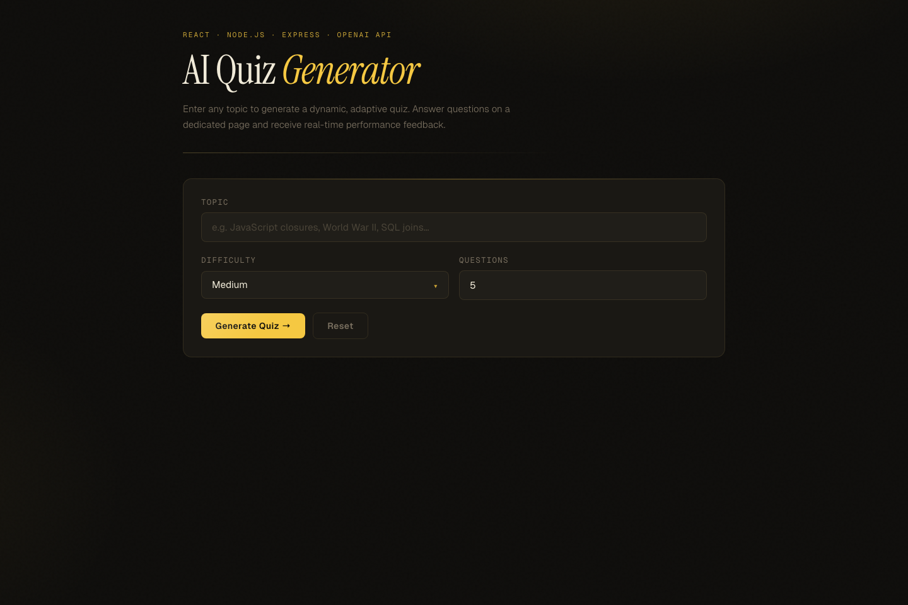
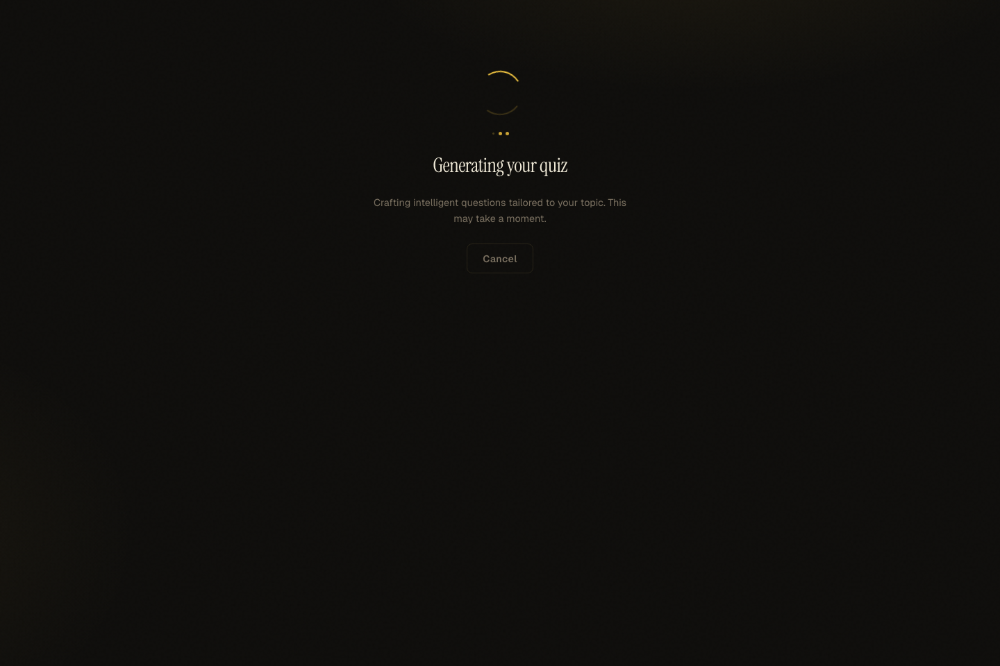
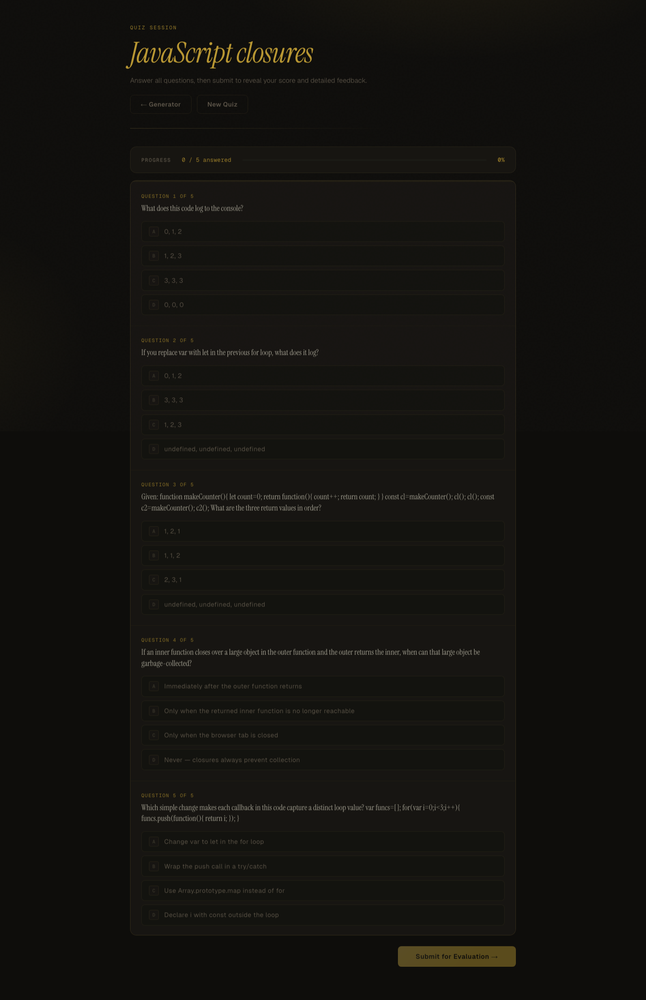
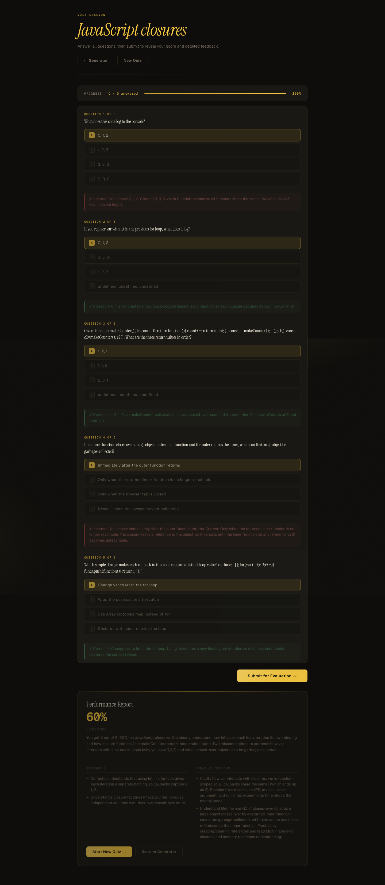

# AI Quiz Generation App

Full-stack app that generates dynamic quizzes from a user topic, evaluates responses, and provides real-time performance feedback.

## Screenshots

### Home (topic input)



### Loading after clicking Generate



### Quiz session



### Final performance report



## Tech Stack

- Frontend: React + Vite
- Backend: Node.js + Express
- AI: OpenAI API

## Project Structure

- `client/` React web app
- `server/` Express API for quiz generation/evaluation/feedback
- `assets/` README screenshots

## Prerequisites

- Node.js 18+
- OpenAI API key

## Setup

1. Install backend dependencies:

```bash
cd server
npm install
cp .env.example .env
```

2. Set your OpenAI key in `server/.env`:

```env
OPENAI_API_KEY=your_key_here
OPENAI_MODEL=gpt-4.1-mini
PORT=4000
CLIENT_ORIGIN=http://localhost:5173
```

3. Install frontend dependencies:

```bash
cd ../client
npm install
```

Optional from project root:

```bash
npm run install:all
```

## Run

Open two terminals.

1. Start backend:

```bash
cd server
npm run dev
```

Optional auto-reload (if your OS watch limits allow it):

```bash
npm run dev:watch
```

2. Start frontend:

```bash
cd client
npm run dev
```

Then open `http://localhost:5173`.

From project root, you can also use:

```bash
npm run dev:server
npm run dev:client
```

## What Happens After You Click "Generate Quiz"

1. The frontend trims and validates the topic input.
2. If topic is empty, it shows `Enter a topic to generate a quiz.` and stops.
3. If valid, UI switches to the loading screen and starts a 45-second timeout guard.
4. Frontend sends `POST /api/quiz/generate` with:
   - `topic`
   - `difficulty`
   - `numQuestions`
5. Backend validates the payload and normalizes difficulty/question count.
6. Backend calls OpenAI to generate quiz JSON with title + multiple-choice questions.
7. Backend normalizes quiz output and applies safe fallbacks if needed.
8. Backend stores the quiz in server memory with a new `quizId`.
9. Backend returns a quiz preview payload (questions/options for the session).
10. Frontend saves that quiz in state and navigates to `/quiz/:quizId`.
11. If request fails or times out, frontend shows a clear error and returns control to the user.

## API Endpoints

- `GET /api/health`
- `POST /api/quiz/generate`
- `POST /api/quiz/answer`
- `POST /api/quiz/submit`

## Troubleshooting

- If quiz generation stays on loading, confirm the backend is running: `http://localhost:4000/api/health`
- If you see `Failed to fetch`, start the backend and verify `VITE_API_BASE` points to your API origin.
